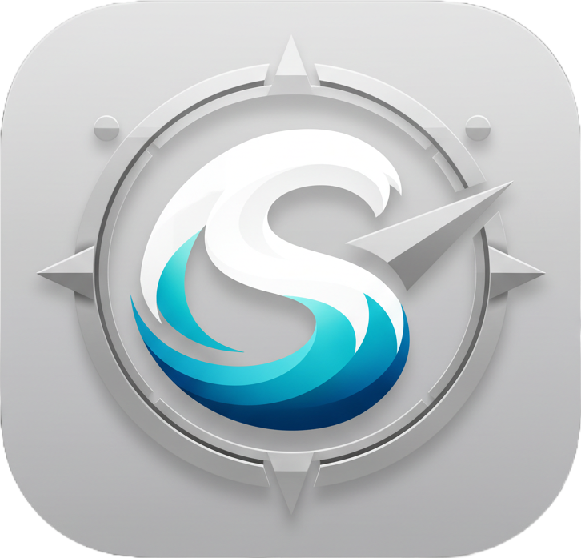

# SurfingBro



SurfingBro is an MCP-driven browser automation system:

- `mcp/` — Go MCP server (tools + resources)
- `extension/` — Browser extension (WebSocket bridge + actions)

Repository: https://github.com/adityalohuni/surfing-bros

## Quick Start

### 0) Clone with submodules

```bash
git clone --recurse-submodules https://github.com/adityalohuni/surfing-bros.git
```

If already cloned without submodules:

```bash
git submodule update --init --recursive
```

### 1) Start MCP server

```bash
cd /home/hage/project/SurfingBro/mcp
go run ./cmd/mcp
```

### 2) Run extension (dev)

```bash
cd /home/hage/project/SurfingBro/extension
pnpm install
pnpm dev
```

Then open the extension popup → **Open MCP Console** → connect to `ws://localhost:9099/ws`.

## Requirements

- Go 1.21+ (MCP server)
- Node.js 18+ and `pnpm` (extension)
- Chrome/Chromium (for the sidepanel)

## Architecture (High Level)

1. MCP server exposes browser tools.
2. Extension background connects to MCP over WebSocket.
3. Content script executes actions in tabs.
4. Sidepanel provides the chat UI and session management.

## Docs

- `mcp/README.md` — MCP tools + workflow memory
- `extension/README.md` — extension actions + protocol
